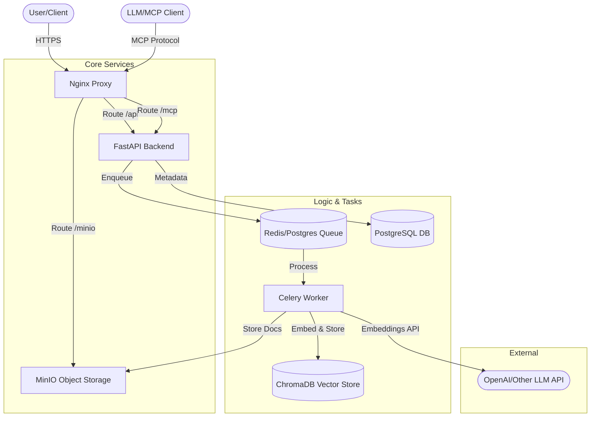

# Architecture: Vector Knowledge Base MCP Server

## Overview
The system is built as a set of containerized services that work together to provide a secure and efficient knowledge base for AI models.

## Component Diagram

## Key Components

### 1. FastAPI Backend
The entry point for all administrative and user requests. It handles:
- API Key validation.
- Knowledge base metadata CRUD.
- Document upload and task dispatch (via Celery).
- FactMCP server implementation for tool exposure.

### 2. Secure MCP Layer
A hardened wrapper around FastMCP that enforces API Key authentication via middleware. It provides:
- `query_knowledge_base`: Retrieves context from multiple KBs.
- `greeting`: A simple diagnostic tool.

### 3. Celery Worker (Document Processor)
Handles long-running I/O and CPU-bound tasks:
- Chunking documents (PDF, Text, etc.).
- Generating embeddings via LLM APIs.
- UPSERTing vectors into ChromaDB.

### 4. Storage Layer
- **PostgreSQL**: Stores KB metadata, document records, and API keys.
- **ChromaDB**: Handles vector similarity search and persistence.
- **MinIO**: Stores the original source files for retrieval or browser viewing.

## Data Flow (Querying)
1. Client sends a query via MCP `query_knowledge_base`.
2. `SecureFastMCP` validates the API Key.
3. `kb_query_service` retrieves relevant knowledge base IDs from Postgres.
4. `chromadb_service` performs a similarity search across specified collections.
5. The result is returned as a formatted JSON response with context and metadata.
